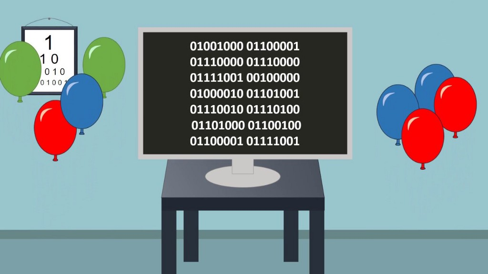

# Happy birthday met Sonic Pi

In dit project gaan we het bekende verjaardagsliedje *Happy birthday* programmeren in **Sonic Pi**.

**Sonic Pi** is een open-source programmeeromgeving, ontworpen om nieuwe geluiden te vormen in een live codeeromgeving; het is ontwikkeld door dr. Sam Aaron op de Universiteit van Cambridge. Hij gebruikt de software om live op te treden met zijn band.  
Meer informatie over **Sonic Pi** vind je op de [Sonic Pi-pagina](https://coderdojo-leiden.github.io/sonic-pi/) van CoderDojo Leiden. Hier vind je o.a. waar je **Sonic Pi** kunt downloaden en een flink aantal projecten om met **Sonic Pi** aan de slag te gaan.  
Zorg dat je een installatie van **Sonic Pi** op je laptop hebt voordat je verdergaat met dit project.

## Inhoud

1. De muziek van *Happy birthday*
2. De eerste regel programmeren
3. Uitdaging: Het tempo aanpassen
4. De tweede regel programmeren
5. Uitdaging: Het geluid aanpassen
6. De overige regels programmeren
7. De voorbereidingen voor een beat
8. Uitdaging: De beat toevoegen
9. Nog meer uitdagingen

[Naar de eerste stap >>](stap_1.md)

 Dit werk valt onder een <a rel="license" href="http://creativecommons.org/licenses/by-nc-sa/4.0/">Creative Commons Naamsvermelding-NietCommercieel-GelijkDelen 4.0 Internationaal-licentie</a>.
