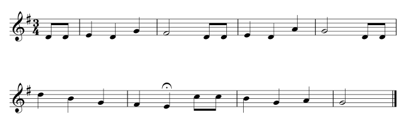

# De muziek van *Happy birthday*

Zo ziet de muziek van *Happy birthday* er uit:

Schrik niet! Het is leuk als je noten kunt lezen, maar het is helemaal niet nodig voor dit project.
De tekst bij deze muziek bestaat uit vier regels:

1. Happy birthday to you
2. Happy birthday to you
3. Happy birthday CoderDojo
4. Happy birthday to you

De muziek voor deze vier regels gaan we stapje voor stapje programmeren en tussendoor gaan we de muziek ook nog wat spannender maken.

[De volgende stap >>](stap_2.md)
