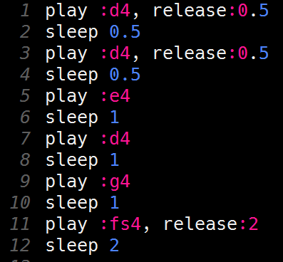

# De eerste regel programmeren

De eerste regel van *Happy birthday* bestaat uit zes noten. De eerste twee noten duren een halve tel, dan komen drie noten die een hele tel duren en de laatste noot duurt twee tellen.  
Dit zijn de noten:

| **Noot** | **Lengte** |
|:-------- |:---------- |
| :d4      | halve tel  |
| :d4      | halve tel  |
| :e4      | 1 tel      |
| :d4      | 1 tel      |
| :g4      | 1 tel      |
| :fs4     | 2 tellen   |  

 
Een noot speel je met het `play` commando. Bijvoorbeeld, voor het spelen van de derde noot gebruik je  
`play :e4`.

Om Sonic Pi te laten wachten met het spelen van de volgende noot, gebruik je het `sleep` commando. Bijvoorbeeld, na het play commando voor de derde noot gebruik je  
`sleep 1`.

Als je het `play` commando met alleen de te spelen noot gebruikt, dan duurt de noot precies 1 tel. Als de noot korter of langer moet duren, dan moet je de `release` optie toevoegen aan je `play` commando. Bijvoorbeeld, voor het spelen van de eerste noot gebruik je  
`play :d4, release:0.5`.  
(Gevolgd door `sleep 0.5` om een halve tel te wachten tot de volgende noot.)  
Let op: voor een halve tel gebruik je 0.5 (met een punt) en niet 0,5 (met een komma)!

Probeer de noten van de eerste regel maar eens te programmeren.  
Als je er niet uitkomt: het antwoord staat verderop op deze pagina.

Druk op de `Run` knop om je muziek te testen.

  

    <b>Hint</b> Zo zou je code voor de eerste regel er uit moeten zien:
  

   
  
   

  

 
[De volgende stap >>](stap_3.md)
