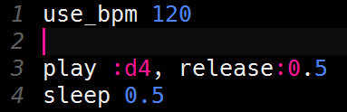

# Uitdaging: Het tempo aanpassen

Het tempo van de eerste regel die je net geprogrammeerd hebt, is wel erg laag. Dat wordt een sloom liedje als we zo doorgaan!

Als je Sonic Pi niets vertelt, dan speelt Sonic Pi je muziek af met 60 bpm. bpm staat voor beats per minute of tellen per minuut in het Nederlands. 60 bpm betekent dat 1 tel 1 seconde duurt (en dus een halve tel een halve seconde).

Met het `use_bpm` commando kun je het tempo van je muziek aanpassen. Als je  
`use_bpm 60`  
gebruikt, dan verandert er niets. Als je bijvoorbeeld  
`use_bpm 120`  
gebruikt, dan speelt je muziek 2 keer zo snel.

Het `use_bpm` commando zet je voor de code waarvoor het tempo moet worden aangepast. Als je het `use_bpm` commando toevoegt voor de code voor de eerste regel van *Happy birthday*, dan zou het begin van je code er zo uit moeten zien:

Probeer eens verschillende bpm-waarden (bijvoorbeeld kleiner dan 60, tussen 60 en 120 en groter dan 120) en kijk welke jij het beste vindt.

[De volgende stap >>](stap_4.md)
