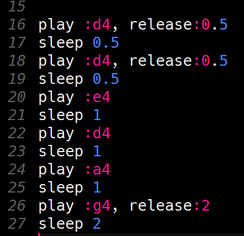

# De tweede regel programmeren

De tweede regel van *Happy birthday* bestaat ook uit zes noten. Dit zijn de noten:

| **Noot** | **Lengte** |
|:-------- |:---------- |
| :d4      | halve tel  |
| :d4      | halve tel  |
| :e4      | 1 tel      |
| :d4      | 1 tel      |
| :a4      | 1 tel      |
| :g4      | 2 tellen   |  

 
Probeer nu de noten van de tweede regel maar eens te programmeren. Voeg ze toe aan het einde, na de code voor de eerste regel.  
Als je er niet uitkomt: het antwoord staat weer verderop op deze pagina.

Druk op de `Run` knop om je muziek te testen.

  

    <b>Hint</b> Zo zou je code voor de tweede regel er uit moeten zien:
  

   
  
   

  

 
[De volgende stap >>](stap_5.md)
