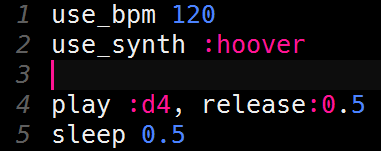

# Uitdaging: Het geluid aanpassen

Het geluid van de twee regels die je nu geprogrammeerd hebt is een simpel piepje. Dat klinkt best saai als je de muziek een paar keer gespeeld hebt.

Als je Sonic Pi niets vertelt, dan speelt Sonic Pi je muziek af met de synthesizer (of synth) met de naam `:beep`. Maar Sonic Pi heeft nog veel meer synths aan boord die veel spannender klinken!

Met het `use_synth` commando kun je een andere synth kiezen. Als je  
`use_synth :beep`  
gebruikt, dan verandert er niets. Als je bijvoorbeeld  
`use_synth :hoover`  
gebruikt, dan krijg je een heel ander geluid.

Het `use_synth` commando zet je voor de code waarvoor het geluid moet worden aangepast. Als je het `use_synth` commando toevoegt voor de code voor de eerste regel van *Happy birthday*, dan zou het begin van je code er zo uit moeten zien:

Probeer eens andere synths om te horen welk geluid het beste bij jouw uitvoering van *Happy birthday* past. Je kunt zelfs meerdere synths in je uitvoering gebruiken, bijvoorbeeld door een `use_synth` commando toe te voegen vlak voor de code voor de tweede regel!

[De volgende stap >>](stap_6.md)
