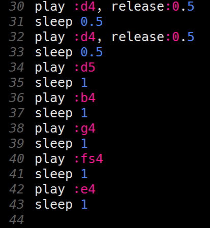
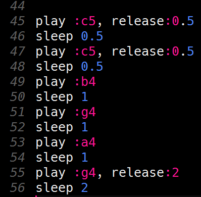

# De overige regels programmeren

De derde regel van *Happy birthday* bestaat uit zeven noten. Dit zijn de noten:

| **Noot** | **Lengte** |
|:-------- |:---------- |
| :d4      | halve tel  |
| :d4      | halve tel  |
| :d5      | 1 tel      |
| :b4      | 1 tel      |
| :g4      | 1 tel      |
| :fs4     | 1 tel      |
| :e4      | 1 tel      |  

 
Probeer nu de noten van de derde regel te programmeren. Voeg ze toe aan het einde, na de code voor de tweede regel.
Als je er niet uitkomt: het antwoord staat weer verderop op deze pagina.

Druk op de `Run` knop om je muziek te testen.

  

    <b>Hint</b> Zo zou je code voor de derde regel er uit moeten zien:
  

   
  
   

  

 
De vierde (en laatste) regel van *Happy birthday* bestaat uit zes noten. Dit zijn de noten:

| **Noot** | **Lengte** |
|:-------- |:---------- |
| :c5      | halve tel  |
| :c5      | halve tel  |
| :b4      | 1 tel      |
| :g4      | 1 tel      |
| :a4      | 1 tel      |
| :g4      | 2 tellen   |  

 
Probeer nu de noten van de vierde regel te programmeren. Voeg ze toe aan het einde, na de code voor de derde regel.  
Als je er niet uitkomt: het antwoord staat weer verderop op deze pagina.

Druk op de `Run` knop om je muziek te testen.

  

    <b>Hint</b> Zo zou je code voor de vierde regel er uit moeten zien:
  

   
  
   

  

 
[De volgende stap >>](stap_7.md)

 Dit werk valt onder een <a rel="license" href="http://creativecommons.org/licenses/by-nc-sa/4.0/deed.nl">Creative Commons Naamsvermelding-NietCommercieel-GelijkDelen 4.0 Internationaal-licentie</a>.
