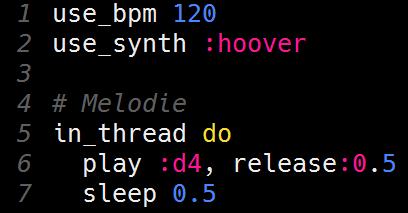
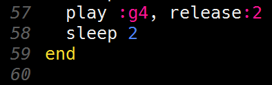

# De voorbereidingen voor een beat

Je hebt nu alle noten voor Happy birthday geprogrammeerd. Maar wat is muziek zonder een beat?

Je beat moet natuurlijk tegelijk met je melodie spelen. Om dingen tegelijk te kunnen doen (of in technische taal: parallel uitvoeren) in Sonic Pi moet je je code in een zogenaamde thread stoppen. Als je meerdere threads hebt, dan worden die tegelijk door Sonic Pi uitgevoerd.

Met het `in_thread` commando kun je aangeven dat je je code in een thread wilt laten uitvoeren. Om te bepalen welke code precies in de thread hoort moet je `do` vlak voor het begin van de code en `end` vlak na de code zetten.

Voeg `in_thread do` toe vlak voor het begin van je melodie. Het begin van je code zou er zo uit moeten zien:

Uiteraard kan het zijn dat je een andere bpm-waarde of een andere synth gekozen hebt. Laat die maar lekker staan!

Merk op dat er ook nog een regel `# Melodie` is toegevoegd. Een regel die met een hekje (`#`) begint, wordt commentaar genoemd. Je gebruikt het bijvoorbeeld om uit te leggen wat je code doet of hoe je code werkt. Het kan iemand anders die jouw code leest helpen om je code te begrijpen, maar jou zelf ook als je je code over een jaar of zo weer eens bekijkt!

Voeg ook nog `end` toe vlak na het einde van je melodie. Het einde van je code zou er dan zo uit moeten zien:

[De volgende stap >>](stap_8.md)
