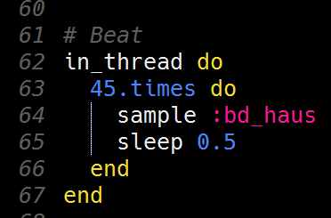

# Uitdaging: De beat toevoegen

Je bent nu helemaal klaar om je eigen beat toe te voegen aan *Happy birthday*!

Zoals uitgelegd is in de vorige stap heb je een nieuwe thread nodig om je beat tegelijk met je melodie te laten spelen. Voeg een regel met `in_thread do` toe na je thread met de melodie en voeg hierna nog een regel toe met `end`. Voeg eventueel nog een regel commentaar (bijvoorbeeld `# Beat`) toe vlak voor het begin van de nieuwe thread voor je beat.

Je zou dan al zoiets moeten hebben:  
`# Beat`  
`in_thread do`  
`end`  
maar daarmee heb je nog geen beat!

Voor je beat gebruik je samples. Samples zijn opgenomen geluiden. Sonic Pi heeft een heleboel samples aan boord, waaronder een hoop drumgeluiden die perfect zijn om een vette beat te maken!

Met het `sample` commando speel je een sample af. Als je bijvoorbeeld  
`sample :bd_haus`  
gebruikt, dan hoor je een vet basdrumgeluid. Probeer eens andere (drum-) samples om te horen welke sample het beste bij jouw beat voor *Happy birthday* past. (Gebruik een andere buffer in Sonic Pi om je favoriete sample te zoeken en uit te proberen zonder dat je iedere keer *Happy birthday* moet afspelen.)

Na een `sample` commando voeg je nog een `sleep` commando toe om te wachten tot de sample klaar is met spelen, net zoals je bij het `play` commando doet. Gebruik bijvoorbeeld  
`sleep 0.5`  
om je beat hetzelfde ritme als je melodie te geven. Maar uiteraard kun je een kleiner getal gebruiken, om een snellere beat te krijgen, of een groter getal om een langzamere beat te krijgen.

Het laatste dat nodig is om een fatsoenlijke beat te krijgen is herhaling! Je sample moet herhaald worden vanaf de eerste noot van *Happy birthday* tot de laatste noot. Als je goed telt, dan zitten er precies 22 tellen vanaf tot de eerste tot de laatste noot. Als je bijvoorbeeld de samples iedere halve tel wilt laten horen en op de laatste noot ook nog één sample wilt laten horen dan heb je 22 × 2 + 1 = 45 samples nodig.

Uiteraard ga je niet 45 keer hetzelfde `sample` en `sleep` commando coderen! Daarvoor hebben we in Sonic Pi lussen. Als je in Sonic Pi een serie commando’s een vast aantal keren wilt herhalen, dan gebruik je daarvoor de `times` functie. Gebruik bijvoorbeeld  
`45.times`  
om je commando’s 45 keer uit te voeren. Net als bij het `in_thread` commando heb je ook hier een `do` en een `end` nodig om aan te geven welke serie commando’s je wilt herhalen.

Als je dit allemaal combineert, dan ziet de code voor je beat er ongeveer zo uit:

Uiteraard kan het zijn dat je een andere sample gebruikt, of je beat sneller of langzamer gemaakt hebt (en dan heb je ook een ander getal dan 45 gebruikt).

[De laatste stap >>](stap_9.md)

 Dit werk valt onder een <a rel="license" href="http://creativecommons.org/licenses/by-nc-sa/4.0/deed.nl">Creative Commons Naamsvermelding-NietCommercieel-GelijkDelen 4.0 Internationaal-licentie</a>.
